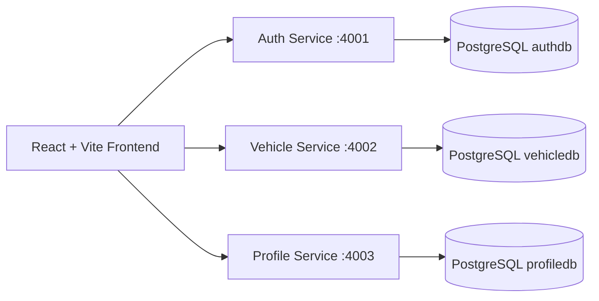
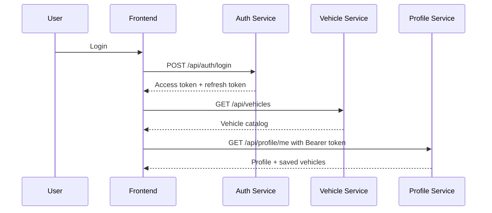
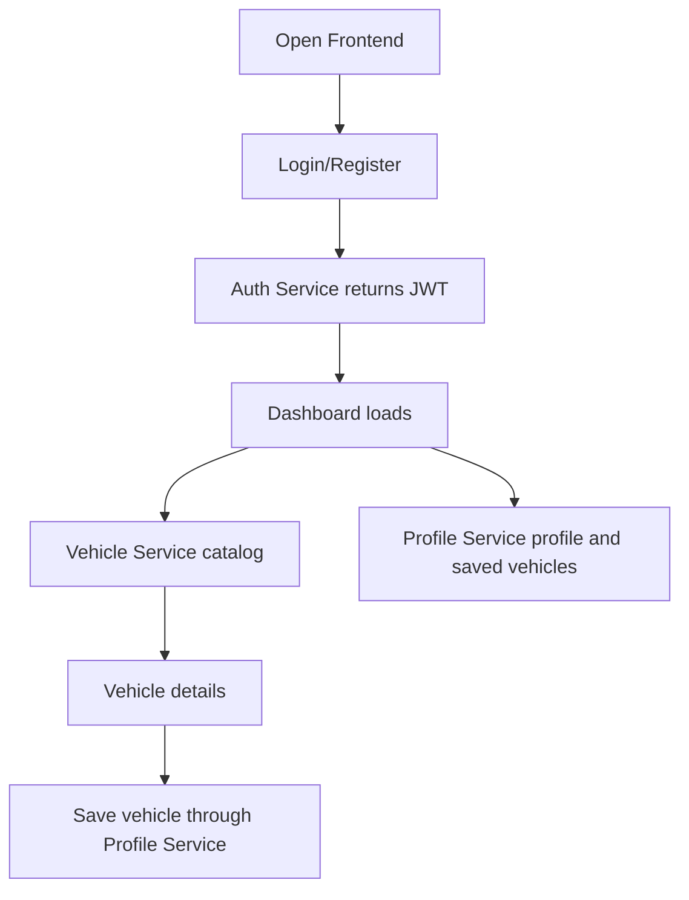

# VW Microservice Automobile Platform

A development-focused Volkswagen-inspired automobile platform built with React, Node.js, Express, PostgreSQL, JWT authentication, and simple Docker Compose orchestration.

This project is intentionally scoped for clean software development and cloud deployment learning. It avoids Kubernetes, Helm, Terraform, CI/CD, service mesh, ingress controllers, and production infrastructure tooling.

## 1. Project Overview

The application provides a premium dark automotive experience with:

- JWT-based registration, login, refresh, and role-aware sessions
- Vehicle catalog with categories, specifications, pricing, search, filters, and pagination
- User profile management, saved vehicles, and preferences
- React dashboard, vehicle listing, vehicle details, authentication pages, and route guards
- Separate microservices with independent Dockerfiles and environment configuration

## 2. Architecture Explanation

Each backend service owns its own PostgreSQL schema and exposes REST APIs. The frontend communicates directly with service APIs through an Axios integration layer.



## 3. Microservices Explanation

- Frontend Service: React + Vite app with route guards, context auth state, API clients, reusable components, and premium VW-inspired UI.
- Auth Service: Handles registration, login, refresh tokens, logout, role support, password hashing, validation, and JWT issuance.
- Vehicle Service: Handles vehicle CRUD, categories, specifications, image URLs, filters, search, and pagination.
- User Profile Service: Handles profile data, saved vehicles, preferences, and protected user-specific APIs.

## 4. Complete Folder Structure

```text
VW_MICROSERVICE/
  docker-compose.yml
  README.md
  auth-service/
    Dockerfile
    README.md
    package.json
    .env.example
    src/
      server.js
      app.js
      config/
      controllers/
      middleware/
      models/
      repositories/
      routes/
      services/
      utils/
      validators/
  vehicle-service/
    Dockerfile
    README.md
    package.json
    .env.example
    src/
      server.js
      app.js
      config/
      controllers/
      middleware/
      models/
      repositories/
      routes/
      services/
      utils/
      validators/
  profile-service/
    Dockerfile
    README.md
    package.json
    .env.example
    src/
      server.js
      app.js
      config/
      controllers/
      middleware/
      models/
      repositories/
      routes/
      services/
      utils/
      validators/
  frontend/
    Dockerfile
    README.md
    package.json
    .env.example
    index.html
    vite.config.js
    src/
      main.jsx
      App.jsx
      assets/
      components/
      context/
      hooks/
      layouts/
      pages/
      routes/
      services/
      styles/
```

## 5. Tech Stack

- Frontend: React 18, Vite, React Router, Axios, Lucide React
- Backend: Node.js, Express
- Database: PostgreSQL
- Auth: JWT, refresh tokens, bcrypt password hashing
- Validation: express-validator
- Security Basics: helmet, cors, input validation, centralized error handling
- Containers: Dockerfiles and Docker Compose

## 6. Service Communication Flow



## 7. Authentication Flow

1. User registers with name, email, password, and optional role.
2. Auth service hashes the password with bcrypt.
3. Login returns a short-lived access token and longer-lived refresh token.
4. Protected routes send `Authorization: Bearer <accessToken>`.
5. Refresh endpoint rotates access token using the stored refresh token.
6. Logout revokes the refresh token.

## 8. PostgreSQL Design

Docker Compose creates three PostgreSQL databases:

- `authdb`: users and refresh tokens
- `vehicledb`: vehicle catalog
- `profiledb`: profiles, saved vehicles, and preferences

Services initialize their own tables on startup for beginner-friendly local development.

## 9. API Overview

Auth Service:

- `POST /api/auth/register`
- `POST /api/auth/login`
- `POST /api/auth/refresh`
- `POST /api/auth/logout`
- `GET /api/auth/me`
- `GET /health`

Vehicle Service:

- `GET /api/vehicles`
- `GET /api/vehicles/categories`
- `GET /api/vehicles/:id`
- `POST /api/vehicles`
- `PUT /api/vehicles/:id`
- `DELETE /api/vehicles/:id`
- `GET /health`

Profile Service:

- `GET /api/profile/me`
- `PUT /api/profile/me`
- `GET /api/profile/saved-vehicles`
- `POST /api/profile/saved-vehicles`
- `DELETE /api/profile/saved-vehicles/:vehicleId`
- `GET /api/profile/preferences`
- `PUT /api/profile/preferences`
- `GET /health`

## 10. Environment Variables

Each service includes its own `.env.example`. For Docker Compose, defaults are already wired in `docker-compose.yml`.

Important variables:

- `PORT`
- `DATABASE_URL`
- `JWT_SECRET`
- `JWT_REFRESH_SECRET`
- `CORS_ORIGIN`
- `VITE_AUTH_API_URL`
- `VITE_VEHICLE_API_URL`
- `VITE_PROFILE_API_URL`

## 11. Manual Local Setup

Install dependencies per service:

```bash
cd auth-service && npm install
cd ../vehicle-service && npm install
cd ../profile-service && npm install
cd ../frontend && npm install
```

Create PostgreSQL databases named `authdb`, `vehicledb`, and `profiledb`, then copy each `.env.example` to `.env` and update connection strings.

Run services:

```bash
cd auth-service && npm run dev
cd vehicle-service && npm run dev
cd profile-service && npm run dev
cd frontend && npm run dev
```

## 12. Docker Compose Setup

From the repository root:

```bash
docker compose up --build
```

Open:

- Frontend: `http://localhost:5173`
- Auth Service: `http://localhost:4001/health`
- Vehicle Service: `http://localhost:4002/health`
- Profile Service: `http://localhost:4003/health`

## 13. Future Scalability Possibilities

- Add payment service
- Add notification service
- Add AI chatbot service
- Add recommendation engine
- Add admin analytics
- Add inventory and booking services
- Add async messaging for cross-service events
- Add API gateway later without changing core services

## 14. Future Cloud Deployment Possibilities

This project can later be deployed to:

- Azure Virtual Machines
- Azure Container Apps
- Azure App Service
- Azure Database for PostgreSQL
- Azure Container Registry

## 15. Future Kubernetes Possibilities

The service boundaries and environment-driven configuration are compatible with future Kubernetes learning. You can later add Deployments, Services, ConfigMaps, Secrets, and Ingress without rewriting application code.

## 16. Future Azure Possibilities

Useful future Azure additions:

- Azure PostgreSQL Flexible Server
- Azure Container Registry
- Azure Key Vault
- Azure Monitor
- Azure Application Gateway
- Azure Kubernetes Service

These are intentionally not implemented in this development-focused project.

## 17. Common Troubleshooting

- Database connection failed: confirm `DATABASE_URL` and that PostgreSQL containers are healthy.
- Frontend cannot call APIs: confirm service ports and `VITE_*_API_URL` values.
- Token errors: confirm the same `JWT_SECRET` is shared by services that verify access tokens.
- Port conflicts: stop local processes using ports `4001`, `4002`, `4003`, `5173`, or `5432`.

## 18. Architecture Diagram

```text
                 +------------------------+
                 | React Frontend :5173   |
                 +-----------+------------+
                             |
        +--------------------+--------------------+
        |                    |                    |
+-------v--------+   +-------v----------+  +------v----------+
| Auth :4001     |   | Vehicle :4002    |  | Profile :4003   |
| JWT + Users    |   | Catalog CRUD     |  | User Data       |
+-------+--------+   +-------+----------+  +------+----------+
        |                    |                    |
+-------v--------+   +-------v----------+  +------v----------+
| authdb         |   | vehicledb        |  | profiledb       |
+----------------+   +------------------+  +-----------------+
```

## 19. Request Flow Diagram



## 20. Development Notes

- The code uses controller, service, repository, validator, middleware, config, model, and utility layers.
- Database tables are initialized at service startup for smoother learning.
- Vehicle seed data is inserted only when the vehicle table is empty.
- The frontend stores tokens in local storage for development simplicity.
- No `.gitignore` is included because this project intentionally omits it.
